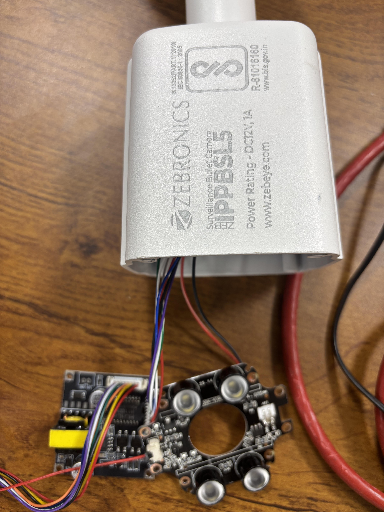
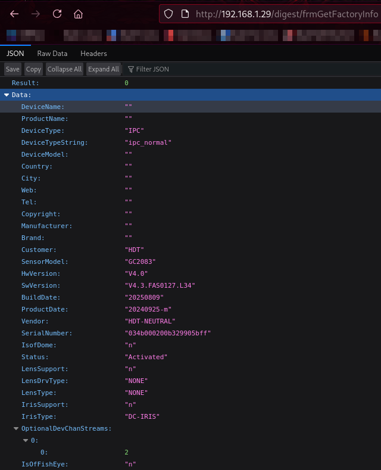
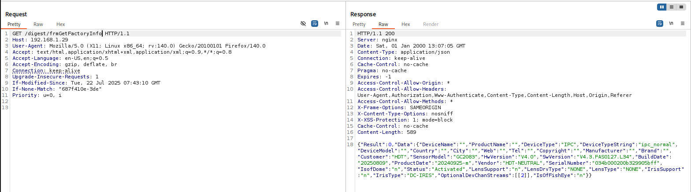

## Summary
The device exposes sensitive system and firmware information through unauthenticated endpoints such as /digest/frmGetFactoryInfo. An attacker can retrieve detailed device metadata - including firmware version, serial number, hardware details, and vendor information - without authentication. This information can be leveraged for device fingerprinting, targeted exploitation, and reconnaissance, significantly increasing the attack surface.

  

## Affected Device
- **Device**: Zebronics IPPBSL5 Network Camera  
- **Firmware**: V4.3.FAS0127.L34

 ## Affected Components
- `ovfs_webserver`
- Authentication handler (`web_semantic_authA`)
- Endpoint:
  - `/digest/frmGetFactoryInfo`

## Vulnerability Details

1. The endpoint `/digest/frmGetFactoryInfo` is accessible without authentication.
2. A GET request returns structured JSON data.
3. The response includes:
   - Firmware version
   - Serial number
   - Hardware version
   - Sensor model
   - Vendor and manufacturer details
4. No session, token, or credentials are required to access this information.

## Impact

- Device fingerprinting
- Exposure of firmware and hardware details
- Increased effectiveness of targeted exploits
- Information leakage aiding further attack chaining

## Proof of Concept (PoC)
GET /digest/frmGetFactoryInfo HTTP/1.1
Host: 192.168.1.29
User-Agent: Mozilla/5.0 (X11; Linux x86_64; rv:140.0) Gecko/20100101 Firefox/140.0
Accept: text/html,application/xhtml+xml,application/xml;q=0.9,*/*;q=0.8
Accept-Language: en-US,en;q=0.5
Accept-Encoding: gzip, deflate, br
Connection: keep-alive
Upgrade-Insecure-Requests: 1
If-Modified-Since: Tue, 22 Jul 2025 07:43:10 GMT
If-None-Match: "687f410e-3de"
Priority: u=0, i

